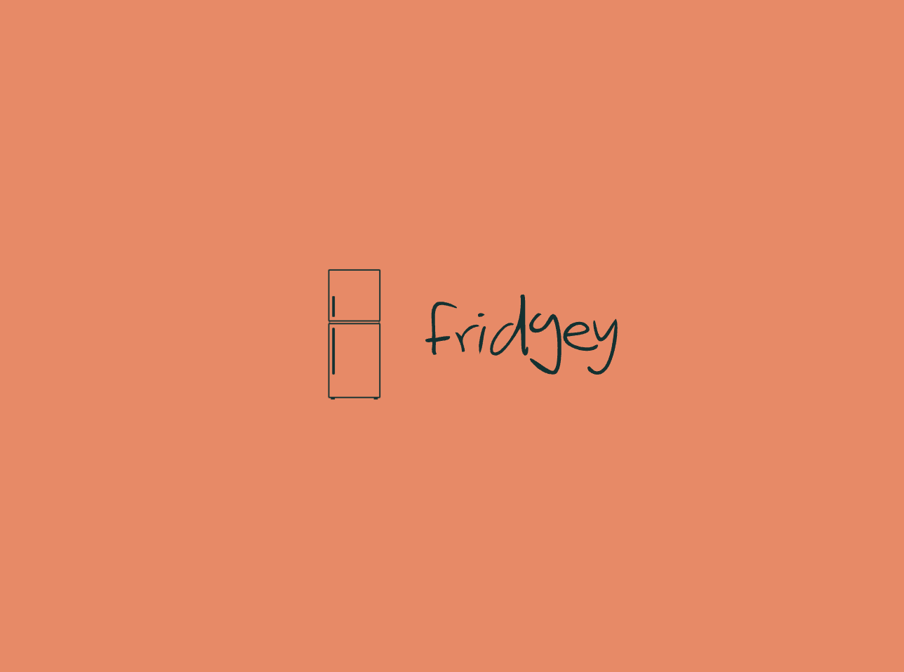

# Fridgey

## Fridge efficiency at its finest!

> **What will the application do?**
> - Keep track of the items currently stored within the refrigerator 
> - Keep track of each item's expiration dates
> - View each item's quantity
> - View all the items
> - Search for an item 

> **Who will use it?**
> - Everyone wanting to efficiently manage their refrigerator
> - For those who often throw away items because they forget to eat it before the expiration date.

> **Why is this project of interest to you?**
> - Many people often forget that they had the item that they needed already in their fridge or couldn't find it because it was too well hidden. However, by building this software, I hope these events never occur again.  

> **What I want my application to do**
> - As a user, I want to be able to add items into the refrigerator 
> - As a user, I want to be able to remove items inside the refrigerator
> - As a user, I want to be able to search if an item is currently in the refrigerator  
> - As a user, I want to be able to view the expiration dates for a certain item
> - As a user, I want to be able to check the quantity of a certain item 
> - As a user, I want to be view all the items 

> **Data Persistence**
> - As a user, I want to be able to save my items to file (if I so choose)
> - As a user, I want to be able to be able to retrieve all my items from file (if I so choose)

[//]: # (> - As a user, when I select the quit option from the application menu, I want to be reminded to save my items to file and have the option to do so or not. )

[//]: # (> - As a user, when I start the application, I want to be given the option to retrieve my items from file.)

