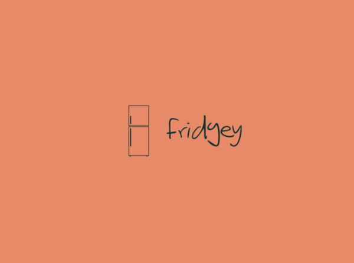

# Fridgey

## Fridge efficiency at its finest!

> **What will the application do?**
> - Keep track of the items currently stored within the refrigerator 
> - Keep track of each item's expiration dates
> - View each item's quantity
> - View all the items
> - Search for an item 

> **Who will use it?**
> - Everyone wanting to efficiently manage their refrigerator
> - For those who often throw away items because they forget to eat it before the expiration date.

> **Why is this project of interest to you?**
> - Many people often forget that they had the item that they needed already in their fridge or couldn't find it because it was too well hidden. However, by building this software, I hope these events never occur again.  

> **What I want my application to do**
> - As a user, I want to be able to add items into the refrigerator 
> - As a user, I want to be able to remove items inside the refrigerator
> - As a user, I want to be able to search if an item is currently in the refrigerator  
> - As a user, I want to be able to view the expiration dates for a certain item
> - As a user, I want to be able to check the quantity of a certain item 
> - As a user, I want to be view all the items 

> **Instructions for Grader**
> - You can generate the first required action (adding) related to adding Xs to a Y by filling in the Name, Expiration Date, Quantity, and State text fields and pressing the "Add Item" button.
> - You can generate the second required action (removing) related to adding Xs to a Y by filling in the Name and pressing the "Remove" button.
> - You can locate my visual component from the application's background
> - You can save the state of my application by pressing the "Save" button
> - You can reload the state of my application by pressing the "Load" button

> **Phase 4: Task 2**
> - An Item has been added
> - An Item has been searched and returned 
> - An Item has been searched and returned 
> - An Item has been removed

[//]: # (> - As a user, when I select the quit option from the application menu, I want to be reminded to save my items to file and have the option to do so or not. )

[//]: # (> - As a user, when I start the application, I want to be given the option to retrieve my items from file.)

